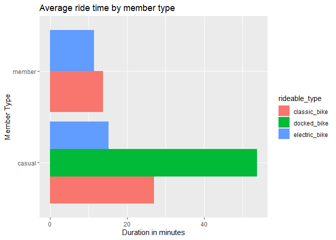

Cyclistic Bike-share Analysis
================

This is a case study completed as part of the Google Data Analytics
Professional Certificate program. The goal here is to analyze the
customer data of a bike-share company (Cyclistic) and assess the
differences between casual riders (purchasers of single rides or day
passes) and Cyclistic members (purchasers of annual memberships). The
ultimate goal would be to create a digital media campaign aimed at
converting casual riders in Cyclistic members. So let’s get to it!

### Importing libraries and data

The data we’ll be looking at is public bike-share made available by
Motivate International Inc. at
<https://divvy-tripdata.s3.amazonaws.com/index.html>, but for our
purposes will be used to represent the fictional business Cyclistic.
Since the data doesn’t come from a third party source, we’ll operate
under the assumption that it’s accurate.

``` r
# using the tidyverse collection of libraries to import and look through the most recent month's data
library(tidyverse)
library(ggmap)
trip_data <- read_csv("trip-data/202305-divvy-tripdata.csv")
```

### Processing the data

With the entire data set loaded, let’s see what we have:

``` r
head(trip_data)
```

    ## # A tibble: 6 x 13
    ##   ride_id          rideable_type started_at          ended_at           
    ##   <chr>            <chr>         <dttm>              <dttm>             
    ## 1 0D9FA920C3062031 electric_bike 2023-05-07 19:53:48 2023-05-07 19:58:32
    ## 2 92485E5FB5888ACD electric_bike 2023-05-06 18:54:08 2023-05-06 19:03:35
    ## 3 FB144B3FC8300187 electric_bike 2023-05-21 00:40:21 2023-05-21 00:44:36
    ## 4 DDEB93BC2CE9AA77 classic_bike  2023-05-10 16:47:01 2023-05-10 16:59:52
    ## 5 C07B70172FC92F59 classic_bike  2023-05-09 18:30:34 2023-05-09 18:39:28
    ## 6 2BA66385DF8F815A classic_bike  2023-05-30 15:01:21 2023-05-30 15:17:00
    ## # i 9 more variables: start_station_name <chr>, start_station_id <chr>,
    ## #   end_station_name <chr>, end_station_id <chr>, start_lat <dbl>,
    ## #   start_lng <dbl>, end_lat <dbl>, end_lng <dbl>, member_casual <chr>

``` r
glimpse(trip_data)
```

    ## Rows: 604,827
    ## Columns: 13
    ## $ ride_id            <chr> "0D9FA920C3062031", "92485E5FB5888ACD", "FB144B3FC8~
    ## $ rideable_type      <chr> "electric_bike", "electric_bike", "electric_bike", ~
    ## $ started_at         <dttm> 2023-05-07 19:53:48, 2023-05-06 18:54:08, 2023-05-~
    ## $ ended_at           <dttm> 2023-05-07 19:58:32, 2023-05-06 19:03:35, 2023-05-~
    ## $ start_station_name <chr> "Southport Ave & Belmont Ave", "Southport Ave & Bel~
    ## $ start_station_id   <chr> "13229", "13229", "13162", "13196", "TA1308000047",~
    ## $ end_station_name   <chr> NA, NA, NA, "Damen Ave & Cortland St", "Southport A~
    ## $ end_station_id     <chr> NA, NA, NA, "13133", "13229", "TA1306000029", "1343~
    ## $ start_lat          <dbl> 41.93941, 41.93948, 41.85379, 41.89456, 41.95708, 4~
    ## $ start_lng          <dbl> -87.66383, -87.66385, -87.64672, -87.65345, -87.664~
    ## $ end_lat            <dbl> 41.93000, 41.94000, 41.86000, 41.91598, 41.93948, 4~
    ## $ end_lng            <dbl> -87.65000, -87.69000, -87.65000, -87.67733, -87.663~
    ## $ member_casual      <chr> "member", "member", "member", "member", "member", "~

Finding some missing values, how many do we have in each column?

``` r
# summing up NA values for every column
sapply(trip_data, function(x) sum(is.na(x)))
```

    ##            ride_id      rideable_type         started_at           ended_at 
    ##                  0                  0                  0                  0 
    ## start_station_name   start_station_id   end_station_name     end_station_id 
    ##              89240              89240              95267              95267 
    ##          start_lat          start_lng            end_lat            end_lng 
    ##                  0                  0                710                710 
    ##      member_casual 
    ##                  0

It looks like about 15% of both the start and end stations are missing
values. Luckily we’ve also got geographic coordinates for these
locations, of which only an insignificant number are missing values, so
we can safely purge those entries. We’ll get rid of the station name and
id columns, as well as ride_id since this just appears to be a unique id
for every entry.

``` r
# selecting desired columns and filtering out rows with NA values
trip_data_clean <- trip_data %>%
  select(
    c(!ride_id & 
        !start_station_name &
        !start_station_id &
        !end_station_name &
        !end_station_id)
  ) %>%
  filter(c(!is.na(end_lat) & !is.na(end_lng)))
# rechecking NA values
sapply(trip_data_clean, function(x) sum(is.na(x)))
```

    ## rideable_type    started_at      ended_at     start_lat     start_lng 
    ##             0             0             0             0             0 
    ##       end_lat       end_lng member_casual 
    ##             0             0             0

Perfect. Before moving on let’s see what kind of values we have for
rideable_type and member_casual.

``` r
distinct(trip_data_clean, rideable_type)
```

    ## # A tibble: 3 x 1
    ##   rideable_type
    ##   <chr>        
    ## 1 electric_bike
    ## 2 classic_bike 
    ## 3 docked_bike

``` r
distinct(trip_data_clean, member_casual)
```

    ## # A tibble: 2 x 1
    ##   member_casual
    ##   <chr>        
    ## 1 member       
    ## 2 casual

Okay, it looks like we have 3 bike types and the 2 expected member
levels; now we can infer some data from what we have, such as ride
length and day of the week the ride was started.

``` r
# adding length of ride as ride_minutes and weekday started as day_of_week
trip_data_rich <- trip_data_clean %>%
  mutate(
    ride_minutes = as.numeric(ended_at - started_at) / 60,
    day_of_week = weekdays(started_at)
  )
# taking a look at the new data set
glimpse(trip_data_rich)
```

    ## Rows: 604,117
    ## Columns: 10
    ## $ rideable_type <chr> "electric_bike", "electric_bike", "electric_bike", "clas~
    ## $ started_at    <dttm> 2023-05-07 19:53:48, 2023-05-06 18:54:08, 2023-05-21 00~
    ## $ ended_at      <dttm> 2023-05-07 19:58:32, 2023-05-06 19:03:35, 2023-05-21 00~
    ## $ start_lat     <dbl> 41.93941, 41.93948, 41.85379, 41.89456, 41.95708, 41.882~
    ## $ start_lng     <dbl> -87.66383, -87.66385, -87.64672, -87.65345, -87.66420, -~
    ## $ end_lat       <dbl> 41.93000, 41.94000, 41.86000, 41.91598, 41.93948, 41.892~
    ## $ end_lng       <dbl> -87.65000, -87.69000, -87.65000, -87.67733, -87.66375, -~
    ## $ member_casual <chr> "member", "member", "member", "member", "member", "membe~
    ## $ ride_minutes  <dbl> 4.733333, 9.450000, 4.250000, 12.850000, 8.900000, 15.65~
    ## $ day_of_week   <chr> "Sunday", "Saturday", "Sunday", "Wednesday", "Tuesday", ~

``` r
summary(trip_data_rich)
```

    ##  rideable_type        started_at                    
    ##  Length:604117      Min.   :2023-05-01 00:00:33.00  
    ##  Class :character   1st Qu.:2023-05-09 21:44:56.00  
    ##  Mode  :character   Median :2023-05-18 15:54:41.00  
    ##                     Mean   :2023-05-17 18:35:48.41  
    ##                     3rd Qu.:2023-05-25 12:37:43.00  
    ##                     Max.   :2023-05-31 23:59:58.00  
    ##     ended_at                        start_lat       start_lng     
    ##  Min.   :2023-05-01 00:04:28.00   Min.   :41.65   Min.   :-87.87  
    ##  1st Qu.:2023-05-09 21:57:37.00   1st Qu.:41.88   1st Qu.:-87.66  
    ##  Median :2023-05-18 16:10:37.00   Median :41.90   Median :-87.64  
    ##  Mean   :2023-05-17 18:52:01.19   Mean   :41.90   Mean   :-87.65  
    ##  3rd Qu.:2023-05-25 12:50:20.00   3rd Qu.:41.93   3rd Qu.:-87.63  
    ##  Max.   :2023-06-07 23:04:26.00   Max.   :42.07   Max.   :-87.53  
    ##     end_lat         end_lng       member_casual       ride_minutes     
    ##  Min.   :41.62   Min.   :-87.91   Length:604117      Min.   :   -1.50  
    ##  1st Qu.:41.88   1st Qu.:-87.66   Class :character   1st Qu.:    5.65  
    ##  Median :41.90   Median :-87.64   Mode  :character   Median :   10.15  
    ##  Mean   :41.90   Mean   :-87.65                      Mean   :   16.21  
    ##  3rd Qu.:41.93   3rd Qu.:-87.63                      3rd Qu.:   18.25  
    ##  Max.   :42.11   Max.   :-87.53                      Max.   :12136.30  
    ##  day_of_week       
    ##  Length:604117     
    ##  Class :character  
    ##  Mode  :character  
    ##                    
    ##                    
    ## 

Okay it looks like there are some negative ride lengths, so at least
some of the ride times weren’t accurately recorded. Given that the
lowest duration is less than 2 minutes, it’s most likely just a case of
station clocks not being synced to the second, which isn’t too much of a
problem for our purposes, but we’ll purge anything with a negative
duration.

``` r
trip_data_rich <- trip_data_rich %>%
  filter(ride_minutes >= 0)
```

### Analyzing the data

With our data in order, we can start to see how the different member
types actually vary. First we’ll see what rideable preferences each
member type has.

``` r
trip_data_rich %>%
  ggplot() +
    geom_bar(aes(member_casual, bg = rideable_type), position = "fill") +
    labs(
      title = "Rideable preference by member type",
      x = "Member type",
      y = "Preference ratio"
  )
```

<!-- -->

It appears both groups have very similar bike preferences, with the
exception Cyclistic members don’t seem to use docked bikes at all
(perhaps this isn’t offered with the annual membership). Let’s see how
long both groups rides each rideable.

``` r
trip_data_rich %>%
  group_by(rideable_type, member_casual) %>%
  reframe(
    ride_minutes = mean(ride_minutes)
  ) %>%
  ggplot() +
    geom_col(aes(ride_minutes, member_casual, bg = rideable_type), position = "dodge") +
    labs(
      title = "Average ride time by member type",
      x = "Duration in minutes",
      y = "Member Type"
    )
```

<!-- -->

We can see that casual riders use rideables for longer than Cyclistic
members, but also that docked bikes tend to be used for the longest
rides. Now to see when they’re riding.

``` r
ordered_days <- factor(trip_data_rich$day_of_week, levels = c("Sunday", "Monday", "Tuesday", "Wednesday", "Thursday", "Friday", "Saturday"))
trip_data_rich %>%
  group_by(day_of_week, member_casual) %>%
  ggplot() +
    geom_bin_2d(aes(ordered_days, member_casual)) +
    labs(
      title = "Rideable usage per weekday",
      x = "Day of week",
      y = "Member type"
    ) +
    guides(x = guide_axis(angle = 45))
```

<!-- -->

Here the difference between member types is seen most clearly. While
both groups ride a similar amount on weekends, the Cyclistic members
make much heavier use of rideables on weekdays, presumably as
transportation to work or school, while at the same time casual riders
are hardly using rideables at all. Finally, we’ll take a look at where
rides are starting and ending.

``` r
map <- get_stamenmap(
  bbox = c(
    left = min(trip_data_rich$start_lng),
    bottom = min(trip_data_rich$start_lat),
    right = max(trip_data_rich$start_lng),
    top = max(trip_data_rich$start_lat)
  ),
  maptype = "terrain"
)
ggmap(map) + trip_data_rich %>%
  geom_point(mapping = aes(x = start_lng, y = start_lat, color = member_casual), position = "jitter", alpha = .5) +
  labs(
    title = "Starting locations",
    x = "Longitude",
    y = "Latitude"
  )
```

<!-- -->

``` r
ggmap(map) + trip_data_rich %>%
  geom_point(mapping = aes(x = end_lng, y = end_lat, color = member_casual), position = "jitter", alpha = .5) +
  labs(
    title = "Ending locations",
    x = "Longitude",
    y = "Latitude"
  )
```

<!-- -->

It looks like Cyclistic members tend to be much closer to the downtown
area and nearby denser residential areas, while casual riders appear
much more in the suburbs.

### Conclusion

The data here shows that the largest differences between member types is
weekday usage and which part of the metro area they ride. My suggestion
for a next step would be to investigate casual riders’ need or interest
in riding on weekdays, and perhaps focusing surveying and campaigning
efforts in the suburban outer reaches of the area.
